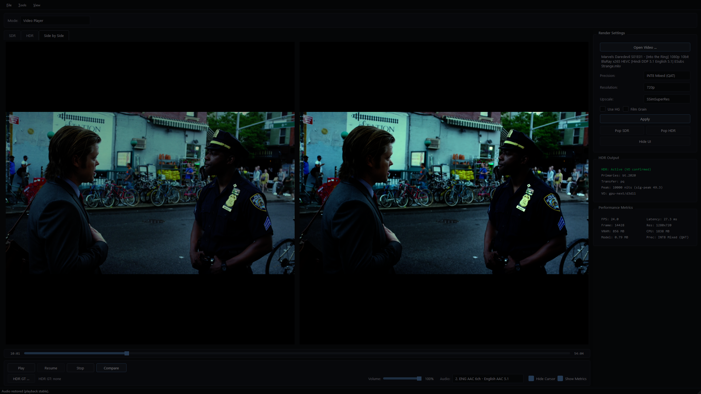
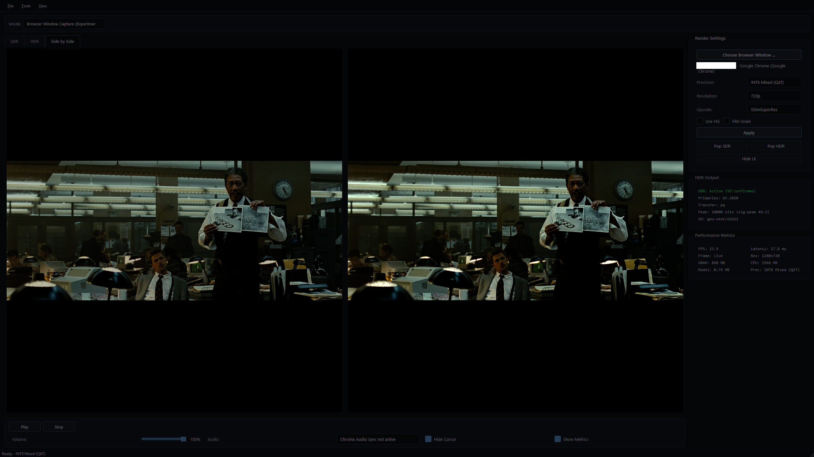
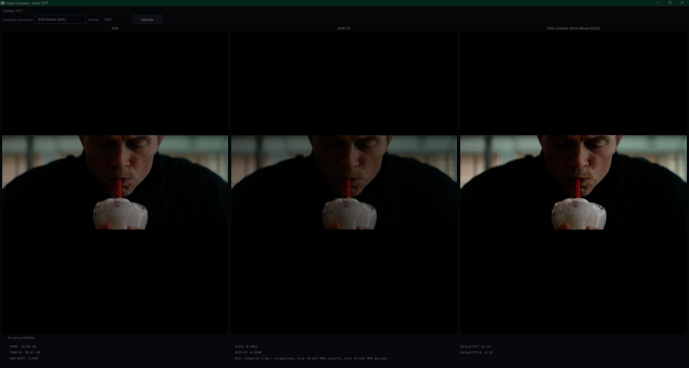
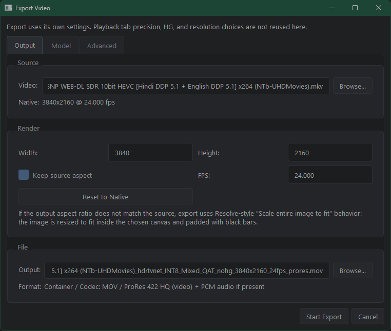
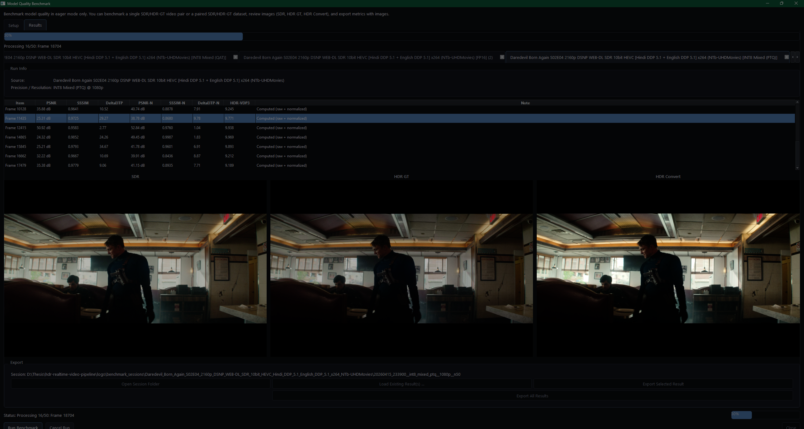

# HDR Real-Time Video Processing Framework


---

## Overview

**Real-Time SDR-to-HDR Video Reconstruction with HDRTVNet++ using TensorRT on NVIDIA and PyTorch on AMD**

This project converts standard dynamic range (SDR) video to high dynamic range (HDR) in real time using HDRTVNet++ and a desktop GUI built around low-latency playback, backend-specific inference, export, and live browser-window viewing.

`v6.0` is the current release, introducing a hybrid inference runtime: NVIDIA devices use TensorRT engines exclusively, while AMD devices keep the existing PyTorch pipeline with channels-last optimization.

Core updates include:

- NVIDIA TensorRT backend for playback, export, benchmark, preview, and CLI inference
- on-demand TensorRT engine creation when a model/resolution/mode is activated
- cached TensorRT engines under `src/models/engines/` using `{model}_{resolution}_{mode}.engine`
- no NVIDIA PyTorch fallback: TensorRT build/load errors are logged and shown to the user without crashing the app
- PyTorch-specific tuning controls are hidden on NVIDIA
- AMD keeps the PyTorch runtime, with channels-last tensors and benchmark mode enabled
- AMD INT8 `Auto` pre-dequantization behavior is preserved
- new `Model Quality Benchmark` tool in `Tools` for both single-video and dataset benchmarking
- deterministic frame/pair selection options with eager-mode quality runs for repeatable objective comparisons
- objective metric domains are now explicit and shared across compare and benchmark:
  - `PSNR` / `SSIM` run on linear HDR frames
  - `DeltaEITP` / `HDR-VDP3` run on a BT.2020/PQ color-managed path
- built-in `HDR-VDP3` bridge now converts BT.2100 PQ inputs back to absolute display luminance before scoring
- benchmark result viewer with SDR/HDR GT/HDR Convert previews, run metadata, and summary reloading
- benchmark session hierarchy (`source_name/timestamp__precision__resolution__n<count>/...`) plus exportable metrics and sample images
- benchmark interaction lock so playback controls (and compare) are frozen while benchmarking is open
- native `Browser Window Capture (Experimental)` video path
- modern Windows direct window capture backend for browser-window video
- Chrome Audio Sync extension kept audio-only, with manual start/stop in Chrome
- Browser Window Capture now observes Chrome compositor frames separately from the low-cost process-FPS budget
- Browser Window Capture now feeds mpv a steady low-FPS stream and lets mpv repeat frames on display vsync instead of forcing 60 fps pipe writes
- Browser Window Capture waits for the HDR mpv display handoff after cold compile, avoiding the occasional black HDR pane / inactive-HDR startup race
- cleaner startup logging by filtering harmless Qt DPI-awareness warning spam
- project-scoped PyTorch kernel caches on AMD so separate local clones do not reuse or delete each other's kernels
- bounded cached-kernel verification with clear-and-recompile recovery when an incompatible cache would otherwise hang warmup
- continued playback/export cleanup from the `v2.x` and `v3.0` work

Windows-only project with **NVIDIA CUDA/TensorRT**, **AMD ROCm-Windows/PyTorch**, and **CPU** backends.

---

## How To Run (Clone Workflow)

No manual asset download is required before setup.

1. Clone the repo.
2. Run `setup.bat` (double-click or terminal).
3. Run `run_gui.bat` to start the app.

What now happens automatically:
- `setup.bat` tries to download `libmpv-2.dll` and `HG_weights.pth` into the repo.
- `run_gui.bat` checks for missing Python dependencies and offers to rerun setup if an update added a new library.
- If `libmpv-2.dll` or `HG_weights.pth` are still missing, the GUI tries to download them on first launch before showing a recovery dialog.

Manual fallback assets link:

`https://drive.google.com/drive/folders/1jh8gXBVzqRse-7w_2Dztca1_KVh5eRu1?usp=drive_link`

---

## Quick Start

```bash
# 1. Clone and set up
git clone https://github.com/DanHelmy/hdr-realtime-video-pipeline.git
cd hdr-realtime-video-pipeline

# 2. Double-click setup.bat
# (or run it in terminal)
.\setup.bat

# 3. Launch the GUI
.\run_gui.bat
```

Open a video and it plays in tabbed SDR/HDR views (with optional side-by-side tab).

---

## UI Tour (v6.0)

### 1. Main Workspace

- Tabbed views: `SDR`, `HDR`, `Side by Side`
- Playback controls, timeline, and live runtime metrics



### 2. Browser Window Capture (Experimental)

- Direct visible-window Chrome capture for video
- Chrome extension handles delayed local audio sync
- Video processing stays on a low-FPS budget while mpv handles display-vsync frame repeat



### 3. Compare / Objective Metrics Dialog

- Side-by-side objective frame comparison workflow
- PSNR / SSIM on linear HDR frames, plus DeltaEITP / HDR-VDP3 on the color-managed HDR path



### 4. Export Dialog

- Independent export settings (separate from playback controls)
- Resolution/FPS/model/precision export controls



### 5. Model Quality Benchmark Tool

- Open from `Tools -> Model Quality Benchmark ...`
- Benchmark a single `SDR video + HDR GT` pair or paired `SDR/HDR GT` dataset folders
- Review objective results with SDR/HDR GT/HDR Convert previews and run metadata (`source`, `precision`, `resolution`)



---

## Browser Audio Sync Extension

The browser extension is already included in this repo. You do not download it separately, and it is now audio-only.

Extension folder:

`browser_tab_capture_extension/`

Use this flow for `Browser Window Capture`:

1. Run the app with `run_gui.bat` or `py src\gui.py`
2. In Chrome, open `Settings > System`
3. Turn off `Use graphics acceleration when available`
4. Restart Chrome
5. Open `chrome://extensions`
6. Turn on `Developer mode`
7. Click `Load unpacked`
8. Select the repo's `browser_tab_capture_extension` folder
9. In HDRTVNet++, choose `Browser Window Capture (Experimental)`
10. In Chrome, open the tab you want and click the extension's `Start Chrome Audio Sync`
11. Back in HDRTVNet++, pick the matching visible Chrome window
12. Adjust the extension delay slider while playback is running until lip-sync looks right
13. Stop Chrome Audio Sync later from the extension popup when you are done

Browser capture pacing:

- Chrome compositor observation runs at up to `HDRTVNET_LIVE_CAPTURE_OBSERVE_FPS` frames per second so 24 fps processing has a fresh recent browser frame available. Default: `30`.
- Video processing samples the latest visible Chrome window frame as a steady `HDRTVNET_LIVE_CAPTURE_PROCESS_FPS` raw-video stream. Default: `24`.
- mpv owns the final display timing with vsync-aware frame repeat, so Python does not need to write 60 frames per second.
- mpv keeps a tiny live jitter buffer so short wake-up or pipe-write stalls repeat a frame instead of creating a visible cadence hole. Default: `HDRTVNET_LIVE_CAPTURE_MPV_BUFFER_FRAMES=3`.
- To reduce load further, set the variables before launching:

```powershell
$env:HDRTVNET_LIVE_CAPTURE_OBSERVE_FPS="30"
$env:HDRTVNET_LIVE_CAPTURE_PROCESS_FPS="20"
$env:HDRTVNET_LIVE_CAPTURE_MPV_BUFFER_FRAMES="3"
.\run_gui.bat
```

Important:

- `Browser Window Capture` is experimental.
- Google Chrome is the only supported browser for synced browser-window playback in this mode.
- Chrome hardware acceleration must be off for this path.
- HDRTVNet++ captures video directly from the visible Chrome window.
- Browser-window video uses a native Windows output-capture backend; performance still depends on window size and monitor configuration.
- The extension is audio-only and delays tab audio locally inside Chrome.
- Chrome Audio Sync now stays active until you stop it manually in the extension.
- HDRTVNet++ stays silent during browser-window playback.
- Browser-window capture observes Chrome separately (`HDRTVNET_LIVE_CAPTURE_OBSERVE_FPS`, default `30`), feeds mpv a steady process-FPS stream (`HDRTVNET_LIVE_CAPTURE_PROCESS_FPS`, default `24`), and lets mpv repeat frames on display vsync.
- After a cold compile, playback waits for mpv to attach before the worker starts producing frames; this prevents the HDR pane from staying black while the worker silently falls back to CPU output.
- Without Chrome Audio Sync, Chrome keeps playing audio locally and it can lead the video.
- If the Chrome source window disappears unexpectedly, HDRTVNet++ now treats that as source loss and restarts cleanly instead of holding onto a dead browser feed.

---

## GUI (v6.0)

```bash
python src/gui.py
```

The GUI is the primary way to use the pipeline. It handles backend selection, model/engine loading, HDR display, export, dedicated objective benchmarking, and live browser-window viewing.

### v6.0 Highlights

- **Hybrid inference runtime**
  - NVIDIA devices use TensorRT engines for all inference
  - AMD devices keep the PyTorch inference path
  - preprocessing and postprocessing are shared so backend output handling stays consistent

- **TensorRT on-demand engine cache for NVIDIA**
  - engines are built only when a mode/model/resolution is activated
  - cache files are saved under `src/models/engines/`
- engine names follow `{model}_{resolution}_{mode}.engine`
- INT8 TensorRT engine names include a `qdqv1` mode suffix so older non-Q/DQ cache files are not reused
  - existing engines load directly on later runs
  - if engine build/load fails, the app logs the error, informs the user, and does not crash
  - NVIDIA does not fall back to PyTorch inference

- **AMD PyTorch path keeps existing controls**
  - PyTorch compile/eager controls remain available on AMD
  - INT8 pre-dequantization controls remain available on AMD
  - channels-last is enabled for AMD PyTorch tensors
  - `Auto` pre-dequantization for AMD INT8 still resolves to pre-dequantize-on

- **NVIDIA UI is TensorRT-focused**
  - PyTorch-specific options are hidden on NVIDIA:
    - INT8 pre-dequantization menu
    - runtime execution mode menu
    - pre-compile kernels
    - clear kernel cache
    - export max-autotune/pre-dequantize advanced controls
  - NVIDIA exposes a dedicated `Clear TensorRT Engine Cache` tool for cached `.engine` files
  - visible NVIDIA controls focus on model, precision/mode, resolution, and HG selection

- **TensorRT replaces PyTorch max-autotune for NVIDIA**
  - TensorRT optimizes during engine build
  - optimized engines are cached and reused
  - no max-autotune background-load warning is shown on NVIDIA

### Previous v5.1 Highlights

- **Objective metric domains are now consistent across compare and benchmark**
  - `PSNR` and `SSIM` are computed from true linear HDR image pairs
  - `DeltaEITP` and `HDR-VDP3` are computed from BT.2020/PQ display-managed image pairs
  - compare and benchmark now call the same shared metric path, so they no longer drift
  - the built-in `HDR-VDP3` bridge now decodes PQ back to absolute photometric values before invoking `hdrvdp3`

- **Model Quality Benchmark tool is now built in (Tools menu)**
  - supports two workflows: `Video (SDR + HDR GT)` and `Dataset Folders (SDR + HDR GT)`
  - runs quality benchmarking in eager mode for deterministic/repeatable metric evaluation
  - video workflow includes deterministic distinct-frame detection and manual frame checkboxes
  - dataset workflow includes paired-file scanning with averaging modes (`selected`, `all`, deterministic subset)
  - result page shows run info (`source name`, `precision`, `resolution`) and supports loading existing JSON/CSV summaries
  - result previews now use the same compare-style color-managed display path for `SDR`, `HDR GT`, and `HDR Convert`
  - session outputs are structured under `logs/benchmark_sessions/<source>/<timestamp>__<precision>__<resolution>__n<count>/...`
  - benchmark locks playback interactions while open and compare is blocked until benchmark closes

- **Native Browser Window Capture replaces the old browser-video bridge**
  - HDRTVNet++ now captures browser video directly from the visible Chrome window
  - the extension is kept only for delayed local Chrome audio
  - the app no longer depends on browser JPEG frame uploads in this mode
- **Chrome Audio Sync is simpler and more explicit**
  - Chrome-only
  - experimental
  - manual delay slider in the extension popup
  - manual stop behavior stays in the extension popup
  - HDRTVNet++ stays silent while Chrome replays delayed tab audio locally
- **Browser Window Capture is more usable as a live viewer**
  - Browser Window Capture now observes Chrome compositor frames separately, then runs HDRTVNet++ only under the low-cost process-FPS budget
  - the direct-window capture path remains the only active browser-video path
  - live browser presentation now uses mpv timed playback (`display-resample`) so frame repeat is handled by the display clock instead of a Python pacing loop
  - HDR output waits for an explicit mpv display handoff after compile, so cold compile startup no longer races into a black HDR pane with inactive HDR metadata
  - if the Chrome source window disappears unexpectedly, the app now restarts cleanly instead of leaving a dead live source attached
- **Startup logging is cleaner**
  - harmless Qt DPI-awareness warnings are filtered so launch logs stay focused on real problems
- **Kernel cache behavior is safer and more local**
  - AMD PyTorch compile caches are scoped per local project checkout, so multiple local copies no longer reuse or wipe each other's kernels
  - FP16 and predequantized mixed INT8 cache markers now line up consistently in both directions when they share the same effective compiled graph
  - cached-kernel verification now detects incompatible "compiled" caches before playback/export enters a stuck warmup path
  - when a cache is incompatible, the app can prompt to clear only the current project's cache and recompile
- **Export workflow remains production-oriented**
  - separate `File > Export Video...` flow with independent precision/model/HG selection
  - source-native resolution/FPS defaults
  - aspect-ratio-safe fit/pad resizing
  - ProRes 422 HQ (`.mov`) + PCM audio only
- **Export and playback polish continues**
  - HDR sources are rejected immediately when chosen
  - keep-aspect ratio editing no longer fights typed values
  - pressing `Enter` in resolution/FPS/path fields no longer starts export accidentally
  - cancel tears down the export runtime and releases GPU resources more cleanly
  - progress/finalization reporting is more truthful during long exports
- **HDR metadata/tagging improved**
  - ProRes exports now use a more reliable BT.2020 / PQ tagging path
  - export conversion path now targets a `1001 nit` HDR peak expectation
- **Playback and export now use a simpler single-frame path**
  - temporal stabilization has been removed globally to reduce GPU cost and keep latency/FPS behavior more predictable
  - browser-window playback, video playback, and export now all follow the same no-temporal-stabilization policy
- **Live metrics are more thesis-friendly**
  - the `Latency` field now reflects model-stage latency instead of mixing in more source-path timing differences
  - app `VRAM` / `CPU` memory remain whole-app runtime metrics, which is more honest than pretending they are model-only allocations
- **Playback session logging is built in**
  - the playback toolbar now includes `Log Session`
  - a logged session saves full runtime metrics such as `FPS`, `latency`, `VRAM`, `CPU`, model precision, and objective metric fields when present
  - compare clicks also save per-frame compare metrics such as `PSNR`, `SSIM`, `DeltaEITP`, normalized variants, and optional `HDR-VDP3`
  - logs are written to `logs/playback_sessions/<timestamp>_<source>/`
  - each session folder includes `summary.txt`, `session.json`, `runtime_metrics.csv`, and `compare_events.csv` when compare was used
- **Experimental AMD max-autotune export reuses the playback compile cache**
  - export uses the same compile/cache keying and compile dialogs as playback
  - max-autotune export uses full Stop behavior first to avoid stale GPU/MIOpen state
- **Modular GUI refactor remains in place**
  - `gui.py` composes focused mixins/modules (`gui_ui_builder.py`, `gui_signal_wiring.py`, `gui_playback_runtime.py`, `gui_pipeline_worker_*.py`, etc.)

### Features

| Feature | Description |
|---|---|
| **Open any video** | Browse or drag-and-drop — playback starts automatically |
| **Browser Window Capture (Experimental)** | Native visible-Chrome window capture with bundled Chrome Audio Sync; samples latest frames under a process-FPS budget and lets mpv repeat them on display vsync |
| **Modular codebase** | GUI and worker logic split into maintainable mixins/modules for easier iteration |
| **Tabbed views** | `SDR`, `HDR`, and `Side by Side` tabs |
| **Pop/Dock panes** | Detach SDR/HDR into separate windows and dock back |
| **Live precision switching** | FP16, FP32, INT8 PTQ/QAT variants — switch mid-playback |
| **HG toggle** | Enable/disable HG refinement (loads HG or no-HG INT8 weights) |
| **Playback controls** | Play / Pause / Resume / Stop |
| **Seek bar** | Drag to seek; when paused, seek is queued and applied on Resume for frame-accurate preview |
| **Paused hot-swap preview** | Precision / pre-dequantize changes can redraw the current paused frame without resuming playback |
| **Performance metrics panel** | FPS, model-stage latency, frame count, app VRAM/CPU memory, checkpoint/export artifact size, precision, processing resolution |
| **Compare metrics dialog** | Pauses playback and opens 3-way frame compare (SDR, HDR GT, HDR Convert) with PSNR/SSIM on linear HDR frames, DeltaEITP on the color-managed HDR path, normalized variants, and optional HDR-VDP3 |
| **Model Quality Benchmark tool** | Tools-menu benchmark dialog for video or dataset objective evaluation, deterministic selection, run metadata display, preview images, and summary export/load |
| **Deterministic compare snapshots** | Compare recomputes the selected frame in an isolated path so the first snapshot matches refresh behavior more reliably |
| **Playback session logs** | `Log Session` saves full runtime metric samples plus compare metrics to `logs/playback_sessions/` as text/JSON/CSV |
| **HDR metadata panel** | Color primaries, transfer function, peak luminance (nits), VO/GPU API |
| **Color handling** | SDR pane uses Rec.709 tagging; HDR pane uses BT.2020/PQ tagging; mpv auto-selects output mapping per display |
| **Hybrid backend selection** | NVIDIA uses TensorRT engines exclusively; AMD uses the existing PyTorch runtime |
| **TensorRT engine cache** | NVIDIA engines are built on demand per model/resolution/mode and reused from `src/models/engines/` |
| **Clear TensorRT engine cache** | NVIDIA-only tool for deleting selected or all cached `.engine` files |
| **PyTorch kernel compilation** | AMD can use Triton/torch.compile caches in a clean subprocess; caches are project-scoped and verified before reuse |
| **Resolution + scaling** | Process at 1080p/720p/540p (or Source fallback) and scale to 1080p output using **EWA LanczosSharp**, **FSR**, or **SSimSuperRes** |
| **Single-frame processing path** | Temporal stabilization is disabled globally for more predictable playback/export cost and latency |
| **Film grain** | Optional film grain restoration (mpv shader) |
| **Video export** | Separate export dialog with native resolution/FPS defaults, independent model preset selection, and ProRes 422 HQ output |
| **Audio support** | Auto-detect, attach external audio, and choose audio track |
| **Volume + stability policy** | Volume slider plus automatic mute below low FPS threshold, with fade-in restore on recovery |
| **Timeline recovery** | Backward seeks and relocks reset stale frame-drop state more reliably to avoid frozen HDR video after the audio already moved |
| **Keyboard shortcuts** | `F11` borderless full-window, `Esc` exit borderless mode, `Space` pause/resume |
| **Cursor idle hide** | Optional auto-hide cursor during playback |
| **INT8 pre-dequantization control** | AMD Tools-menu toggle for `Auto` / `On` / `Off` on INT8 PyTorch runtimes |
| **Runtime execution mode** | AMD Tools-menu toggle for `Compile (recommended)` / `Eager (not recommended)` |
| **Pre-compile kernels** | AMD-only PyTorch kernel precompile for any resolution/precision ahead of time |
| **Clear kernel cache** | AMD-only PyTorch kernel cache clearing for the current project checkout |
| **Dark theme** | Modern dark UI, auto-applied |
| **Persistent GUI settings** | Saved in `.gui_prefs.json` (precision, resolution, view/tab, upscale, film grain, metrics visibility, HG toggle, AMD pre-dequantization/runtime mode, volume, audio track, cursor hide, last-open directory) |

### GUI Launch Flags

`src/gui.py` also accepts startup flags (used by restart/apply flows):

```bash
python src/gui.py --video input.mp4 --resolution 720p --precision FP16 --view Tabbed --autoplay 1 --start-frame 1200 --use-hg 1 --film-grain 1 --hdr-gt hdr_reference.mkv
```

### Objective Metrics (PSNR / SSIM / DeltaEITP / HDR-VDP3)

- Use **HDR GT ...** in the GUI, then click **Compare** to compute per-frame accuracy metrics.
- In `v6.0`, compare and the `Model Quality Benchmark` tool use the same shared full-reference metric pipeline.
- `PSNR` and `SSIM` are computed from the linear HDR image pair.
- `DeltaEITP` and `HDR-VDP3` are computed from a BT.2020/PQ display-managed path derived from that linear HDR pair.
- `DeltaEITP-N` is grade-normalized in absolute linear RGB before BT.2020/PQ conversion; it is not normalized on PQ code values and it is not re-normalized after PQ encoding.
- Shared padded black or near-black borders are cropped from both images before objective metrics when a substantial common letterbox/pillarbox region is detected.
- Ground-truth should be the same content/timing as the input clip for valid measurements.
- `HDR-VDP3` now has a built-in local bridge at `scripts/hdrvdp3_bridge.py`.
  - The built-in bridge accepts BT.2100 PQ input frames and converts them to absolute display luminance / photometric values before calling `hdrvdp3`.
  - The GUI will use it automatically when `HDRTVNET_HDRVDP3_CMD` is not set.
  - If an HDR-VDP3 toolbox is already present from an older run, it is reused and copied into the repo-local folder when possible.
  - New toolbox downloads only happen when GNU Octave is available.
  - First HDR-VDP3 run auto-downloads toolbox files into:
    - `third_party/hdrvdp/`
  - If the repo location is not writable, it falls back to:
    - `%LOCALAPPDATA%\HDRTVNetCache\hdrvdp\`
  - Requires **GNU Octave** installed and available in `PATH`.
- You can still override with your own command using env var `HDRTVNET_HDRVDP3_CMD`.
  - Template placeholders: `{test}` / `{pred}`, `{reference}` / `{ref}`, and `{encoding}`.
- Objective HDR peak for the managed metric path can be adjusted with `HDRTVNET_OBJECTIVE_HDR_PEAK_NITS` (default: `1000`).

### Playback Session Logs

- Click `Log Session` in the playback toolbar to arm logging for the next active playback session.
- Stop playback, close the app, let playback finish, or click the button again to flush the session log to disk.
- Logs are saved under:
  - `logs/playback_sessions/<timestamp>_<source>/`
- Saved files:
  - `summary.txt` for a quick human-readable report
  - `session.json` for the full structured session payload
  - `runtime_metrics.csv` for the sampled runtime stream (`FPS`, latency, `VRAM`, `CPU`, frame index, precision, objective fields when present)
  - `compare_events.csv` for per-click compare metrics (`PSNR`, `SSIM`, `DeltaEITP`, normalized variants, `HDR-VDP3`, notes)
- The worker summary also stores the exact average inference latency across logged inference frames.

### Tools Menu

- **Model Quality Benchmark** — quality benchmarking dialog for video or dataset workflows, with previews, averages, and result export/load
- **INT8 Pre-dequantization** — AMD PyTorch only; choose `Auto`, `On`, or `Off` for INT8 runtime loading behavior
- **Runtime Execution Mode** — AMD PyTorch only; choose compiled or eager execution
- **Pre-compile Kernels** — AMD PyTorch only; compile for any resolution(s) ahead of time
- **Clear Kernel Cache** — AMD PyTorch only; force recompilation (e.g. after a PyTorch / driver update)
- **Clear TensorRT Engine Cache** — NVIDIA only; delete selected or all cached `.engine` files

On NVIDIA, PyTorch-specific tuning and kernel-cache tools are hidden because inference always uses TensorRT engines.

### Video Export

- Open **File -> Export Video...** to export with settings that are independent from the playback controls
- Export defaults to the source clip's **native resolution** and **native FPS**
- You can override resolution/FPS and keep aspect ratio locked; mismatched aspect ratios are fit into the target frame with padding
- Export supports any available model preset (`FP16`, `FP32`, `INT8 PTQ/QAT`, HG on/off) directly from the export dialog
- Output is intentionally limited to **ProRes 422 HQ (`.mov`) + PCM audio**
  - This is a high-quality mezzanine format that avoids recompressing already-compressed sources back into delivery codecs like H.265 during intermediate work
- ProRes export is tagged through the HDR path as **BT.2020 / PQ**, with a `1001 nit` target peak expectation in the export conversion path
- HDR input sources are rejected immediately when selected in the export dialog
- On AMD, export has an **Advanced** tab for:
  - experimental max-autotune compile reuse
  - INT8 pre-dequantize override (`Auto` / `Force On` / `Force Off`)
- On NVIDIA, export uses TensorRT engines and hides PyTorch-specific export tuning controls.
- Export follows the same single-frame processing path as playback; temporal stabilization is disabled globally
- Starting a normal export keeps playback paused/locked for the export run
- Starting an AMD export with **experimental max-autotune** may trigger the same full **Stop** behavior first so compile/warmup can run cleanly
- Canceling an export tears down the export model/runtime and releases GPU resources without requiring an app close

### mpv Display / Color Path

Both SDR and HDR panes are rendered through embedded **mpv** (vulkan):

- **SDR pane**: tagged as **Rec.709** (`bt.709` / `bt.1886`, full range)
- **HDR pane**: tagged as **BT.2020/PQ** (`bt.2020` / `pq`, full range)
- Output target is **auto-detected by mpv/display path** (no hard-forced target primaries/TRC)

> **Requires** `libmpv-2.dll` in the `src/` folder.
> `setup.bat` and first GUI launch now try to download it automatically.
> Manual fallback: shared Google Drive assets folder above (same folder as
> `HG_weights.pth`).  
> Fallback source: [mpv-winbuild](https://sourceforge.net/projects/mpv-player-windows/files/libmpv/)
> (`mpv-dev-x86_64-*-git-*.7z`).

### First Run

NVIDIA and AMD now have different first-run behavior.

**NVIDIA TensorRT**

The first time you play, export, or benchmark a given model/resolution/mode combination, the app checks for a cached TensorRT engine:

`src/models/engines/{model}_{resolution}_{mode}.engine`

INT8 TensorRT modes include a `qdqv1` suffix in the mode portion of the filename.

If the engine is missing, the app loads the selected `.pt` / `.pth` model, exports a cached ONNX file with the same model/resolution/mode stem when needed, builds a TensorRT engine, saves it, and then runs inference through that engine. Later runs load the `.engine` directly. If an ONNX file already exists but the engine does not, the app reuses the ONNX file to rebuild the engine.

The GUI creates the TensorRT engine only when the user activates a mode whose engine is missing. You can also pre-build NVIDIA engines manually:

```bash
python src/build_tensorrt_engines.py 1920x1080 --precision fp16
python src/build_tensorrt_engines.py 1280x720 --precision int8-mixed
python src/build_tensorrt_engines.py 1920x1080 --precision fp16 --force --benchmark-runs 100
```

TensorRT performs optimization during engine build time and caches the result. No PyTorch max-autotune warning is shown on NVIDIA.

New TensorRT builds use the highest TensorRT builder optimization level by default and persist a shared timing cache at `src/models/engines/tensorrt_timing.cache`. Existing `.engine` files keep their current tactics until rebuilt. To compare or refresh them, clear the TensorRT cache from the GUI or run the prebuild script with `--force`.

Advanced TensorRT build environment overrides:

- `HDRTVNET_TRT_BUILDER_OPT_LEVEL=0..5` controls TensorRT builder search depth; default is `5`.
- `HDRTVNET_TRT_WORKSPACE_GB=4` controls builder workspace size in GiB.
- `HDRTVNET_TRT_TIMING_CACHE=path|none` changes or disables the shared timing cache.
- `HDRTVNET_TRT_DEDICATED_STREAM=1|0` runs TensorRT enqueue on a non-default CUDA stream; default is `1`.
- `HDRTVNET_TRT_AUX_STREAMS=N` optionally sets TensorRT build-time auxiliary stream count.

The manual prebuild script also exposes `--opt-level`, `--workspace-gb`, `--timing-cache`, `--aux-streams`, `--force-onnx`, and `--benchmark-runs` so NVIDIA test machines can rebuild and report comparable numbers from one command.

If the TensorRT engine build or load fails, the error is logged and shown to the user. The app does not silently fall back to PyTorch on NVIDIA.

**AMD PyTorch**

The first time you play a video at a given resolution/precision/HG/pre-dequantize combination, `torch.compile` with `max-autotune` may need to compile Triton kernels. This takes **2–5 minutes** and runs in a clean subprocess with a progress dialog.

Compiled PyTorch kernels are **cached to disk**, so:

- subsequent playback on an exact cache hit skips the clean precompile subprocess
- export max-autotune reuses the same compile cache and only compiles cleanly on a real cache miss
- caches are scoped to the current local project checkout instead of being shared implicitly across different local copies of the repo
- if an old or incompatible cache looks "compiled" but would hang warmup, the app can stop early and ask to clear/recompile the current project's cache

PyTorch compile defaults are tuned for fixed-resolution video: `dynamic=False`, `mode=max-autotune`, and two warmup passes. Advanced overrides:

- `HDRTVNET_COMPILE_DYNAMIC=0|1|auto` controls shape specialization; default is `0`.
- `HDRTVNET_COMPILE_FULLGRAPH=1` can be used for experiments, but default is `0` for compatibility.
- `HDRTVNET_COMPILE_WARMUP_RUNS=N` controls compile warmup passes; default is `2`.

---

## Installation

### Requirements

- Python 3.12 (setup scripts target 3.12 for all backends)
- PyTorch 2.9.1 backend wheels from the requirement files
- NVIDIA: TensorRT Python bindings plus ONNX export dependencies
- AMD: ROCm-Windows PyTorch plus optional HIP SDK for compiled PyTorch kernels
- OpenCV, NumPy

### Setup

```bash
# Auto-detect backend and install (double-clickable):
.\setup.bat

# Optional manual override:
powershell -ExecutionPolicy Bypass -File .\scripts\setup.ps1 -Backend nvidia
# or: -Backend amd
# or: -Backend cpu
```

Optional flags:
- `-RecreateVenv` to rebuild `venv` from scratch
- `-RunGui` to auto-launch after setup

### PyTorch GPU Backends

This repo now provides backend-specific requirement files under `requirements/`:

- `requirements/requirements-nvidia.txt` -> common deps + CUDA PyTorch (`cu126`) + ONNX/TensorRT engine build/runtime deps
- `requirements/requirements-amd.txt` -> common deps + ROCm-Windows SDK/PyTorch wheels (+ `triton-windows`)
- `requirements/requirements-common.txt` -> shared app deps only (use with manual CPU PyTorch install)

Equivalent setup scripts:
- `setup.bat` (double-click entry point)
- `scripts/setup.ps1` (auto-detect + override support)
- `run_gui.bat` (double-click GUI launcher)
- `scripts/setup_nvidia.ps1`
- `scripts/setup_amd.ps1`
- `scripts/setup_cpu.ps1`
- `scripts/run_gui.ps1`

**NVIDIA (CUDA, Python 3.12):**
```bash
pip install -r requirements/requirements-nvidia.txt
```
NVIDIA uses TensorRT for inference. PyTorch is still required to load `.pt` / `.pth` checkpoints and export cached ONNX artifacts during first-time model/resolution/mode builds, but Triton is not required for NVIDIA inference.

`setup.bat` / `scripts/setup_nvidia.ps1` performs a post-install NVIDIA runtime check:

- NVIDIA CUDA driver DLL
- `torch.cuda`
- `onnx`
- `onnxscript`
- `tensorrt`
- TensorRT builder creation

A separate CUDA Toolkit/SDK is not required in the AMD HIP SDK sense when the pip wheels provide the needed runtime libraries. If the TensorRT check fails, update the NVIDIA driver first; if it still fails, install the matching NVIDIA CUDA Toolkit / TensorRT runtime from NVIDIA and rerun setup.

**AMD ROCm-Windows (Python 3.12):**
```bash
pip install -r requirements/requirements-amd.txt
```
Recommended for best compatibility/performance:
- Install AMD HIP SDK: `https://www.amd.com/en/developer/resources/rocm-hub/hip-sdk.html`
- Default install path expected by warning checks: `C:\Program Files\AMD\ROCm`

**CPU only:**
```bash
pip install -r requirements/requirements-common.txt
pip install torch torchvision
```

### Backend Setup

**NVIDIA CUDA/TensorRT**: Uses cached TensorRT `.engine` files. Engines are created on demand from the selected PyTorch checkpoint when the matching cache file is missing.

**AMD ROCm-Windows/PyTorch**: Auto-detects HIP SDK for `torch.compile`. `requirements/requirements-amd.txt` already includes `triton-windows`.

---

## Architecture

### Pipeline

NVIDIA:

```
Video Source → GPU Upload → GPU Preprocess → TensorRT Engine → GPU Postprocess → CPU Download / mpv Renderer
```

AMD:

```
Video Source → GPU Upload → GPU Preprocess → torch.compile Model → GPU Postprocess → CPU Download → Renderer
```

### Key Optimizations

- GPU-side preprocessing (BGR→RGB, normalize, permute) and postprocessing (clamp, scale, quantize, RGB→BGR)
- Pre-allocated GPU tensor buffers (zero per-frame allocation)
- Pinned (page-locked) host memory for async H2D/D2H DMA transfers
- `torch.inference_mode()` throughout
- NVIDIA TensorRT engines built on demand and cached per model/resolution/mode
- AMD channels-last PyTorch tensors with benchmark mode enabled
- Async video prefetch queue
- mpv fast path: skips GPU→CPU postprocess when mpv handles HDR display

### Precision Modes

| Mode | Description | Compression |
|---|---|---|
| **FP16** | Half-precision (default on GPU) | — |
| **FP32** | Full precision | — |
| **INT8 Full (PTQ)** | W8A8 quantization (HG optional) | ~4.0× vs FP16+HG |
| **INT8 Full (QAT)** | W8A8 + quantization-aware fine-tuning (HG optional) | ~4.0× vs FP16+HG |
| **INT8 Mixed (PTQ)** | Mixed W8A8/W8A16/FP16-sensitive layers (HG optional) | ~4.0× vs FP16+HG |
| **INT8 Mixed (QAT)** | Mixed W8A8/W8A16/FP16-sensitive layers + quantization-aware fine-tuning (HG optional) | ~4.0× vs FP16+HG |

On AMD, INT8 modes include **pre-dequantization** for GPUs without native INT8 convolution support: INT8 weights are converted to FP16 once at load time, giving native FP16 speed with compressed checkpoint storage. The default `Auto` mode resolves to pre-dequantize-on for AMD.

On NVIDIA, existing quantized checkpoints are still the source files for INT8 modes, but TensorRT export converts their W8/W8A8 wrappers into ONNX `QuantizeLinear` / `DequantizeLinear` Q/DQ graphs before engine build. This is TensorRT's explicit quantization path: calibration/scales are embedded before ONNX export, and no runtime calibration table is used. FP32 modes build FP32 TensorRT engines; FP16 modes build FP16 TensorRT engines.

---

## CLI Mode

For headless benchmarking or scripted workflows:

```bash
# Default (auto device: TensorRT on NVIDIA, PyTorch on AMD/CPU)
python src/main.py

# AMD/CPU PyTorch only: skip torch.compile
python src/main.py --no-compile

# FP32 precision
python src/main.py --precision fp32

# INT8 quantized models (HG on/off)
python src/main.py --precision int8-full --model src/models/weights/Ensemble_AGCM_LE_int8_full.pt
python src/main.py --precision int8-mixed --model src/models/weights/Ensemble_AGCM_LE_int8_mixed.pt
python src/main.py --precision int8-full --model src/models/weights/Ensemble_AGCM_LE_int8_full_qat.pt
python src/main.py --precision int8-mixed --model src/models/weights/Ensemble_AGCM_LE_int8_mixed_qat.pt
python src/main.py --precision int8-full --model src/models/weights/Ensemble_AGCM_LE_int8_full_nohg.pt --use-hg 0
python src/main.py --precision int8-mixed --model src/models/weights/Ensemble_AGCM_LE_int8_mixed_nohg.pt --use-hg 0

# Headless benchmark
python src/main.py --no-display --warmup 30 --timing-interval 120 --max-frames 360 --model-stage-timing
```

<details>
<summary><strong>All CLI Flags</strong></summary>

| Flag | Description |
|---|---|
| `--model PATH` | Model weights path (default: `src/models/weights/Ensemble_AGCM_LE.pth`) |
| `--device auto\|cuda\|cpu` | Device selection (default: auto) |
| `--precision auto\|fp16\|fp32\|int8-full\|int8-mixed` | Inference precision (default: auto → fp16 on GPU) |
| `--compile-mode auto\|default\|reduce-overhead\|max-autotune` | PyTorch backend only; torch.compile mode (auto = max-autotune) |
| `--force-compile` | AMD PyTorch only; force `torch.compile` on ROCm-Windows when HIP SDK auto-detection fails |
| `--no-compile` | PyTorch backend only; disable `torch.compile` entirely |
| `--channels-last` | PyTorch backend only; force channels_last memory format (AMD now enables it automatically) |
| `--cuda-graphs` | PyTorch backend only; enable CUDA graph replay for static shapes |
| `--predequantize auto\|on\|off` | AMD PyTorch INT8; pre-dequantize INT8 weights to FP16 at load time (`auto` resolves on for AMD) |
| `--use-hg 1\|0` | Enable HG refinement (1 = on, 0 = off) |
| `--cache-resolution WxH` | AMD PyTorch only; pre-compile Triton kernels for this resolution at startup (default: auto = video resolution) |
| `--prefetch N` | Video reader prefetch queue size (default: 8) |
| `--model-stage-timing` | Report pre/run/post timing breakdown |
| `--no-display` | Headless mode for pure throughput testing |
| `--warmup N` | Frames to skip before collecting stats (default: 30) |
| `--timing-interval N` | Frames between timing reports (default: 120) |
| `--max-frames N` | Stop after N frames (0 = full video) |
| `--target-fps F` | Target FPS for late-frame and drop stats |
| `--max-width W` | Max processing width (default: 1920) |
| `--max-height H` | Max processing height (default: 1080) |
| `--static-input` | Force resize all frames to max-width × max-height |
| `--letterbox` | Preserve aspect ratio with black bars |

</details>

---

## INT8 Quantization

<details>
<summary><strong>Quantization details</strong></summary>

### HG Weights (Required Download)
`HG_weights.pth` is not included in this GitHub repo because it is too large for
normal GitHub tracking. For clone users, `setup.bat` and the GUI now try to
download it automatically into the repo when it is missing.

If you want to place it manually, download it from the shared Google Drive assets folder:

`https://drive.google.com/drive/folders/1jh8gXBVzqRse-7w_2Dztca1_KVh5eRu1?usp=drive_link`

This folder also contains `libmpv-2.dll`.

Steps:
1. Open the Google Drive folder above.
2. Download `HG_weights.pth`.
3. Place it at:

`src/models/weights/HG_weights.pth`

You can also override the location in CLI mode:

```bash
python src/main.py --hg-weights "FULL/PATH/TO/HG_weights.pth"
```

### W8A8 (Full INT8, HG optional)
```bash
python scripts/quantize/quantize_int8_full.py
```
- Both weights and activations quantized to INT8
- Requires calibration data (default: `dataset/train_sdr/`)
  - **~4.0× compression vs FP16+HG** (HG adds significant weight size)
  - Outputs:
    - `src/models/weights/Ensemble_AGCM_LE_int8_full.pt` (HG)
    - `src/models/weights/Ensemble_AGCM_LE_int8_full_nohg.pt` (no-HG)

### W8A8 (Full INT8) + QAT (HG optional)
```bash
python scripts/quantize/quantize_int8_full_qat.py
```
- Starts from the PTQ full checkpoint and fine-tunes with fake quantization + STE
- Full QAT is now a **PTQ-anchored** full-W8A8 path:
  - freezes a curated set of highlight/color-sensitive layers during training
  - also freezes SFT scale/shift control layers by default
  - uses stronger teacher/highlight anchoring to reduce highlight tint drift while still exporting a full `W8A8` checkpoint
- Learnable weight/activation scales adapt to minimize reconstruction loss against HDR ground truth
- Trains on SDR/HDR pairs from `dataset/` (256×256 random crops, L1 loss)
  - **~4.0× compression vs FP16+HG**
  - Outputs:
    - `src/models/weights/Ensemble_AGCM_LE_int8_full_qat.pt` (HG)
    - `src/models/weights/Ensemble_AGCM_LE_int8_full_qat_nohg.pt` (no-HG)
- Customizable: `--epochs 10 --lr 1e-5` or `--from-scratch`

### Mixed W8A8/W8A16/FP16-Sensitive Layers (HG optional)
```bash
python scripts/quantize/quantize_int8_mixed.py
```
- Per-layer sensitivity sweep automatically assigns layers across:
  - `W8A8` for aggressive compression
  - `W8A16` for safer weight-only quantization
  - full `FP16` for a curated set of highly sensitive control/output layers
- Protected AGCM / SFT control layers are automatically kept out of the most aggressive bucket
- FP16-sensitive exemptions are enabled by default in mixed mode
  - **~4.0× compression vs FP16+HG**
  - Outputs:
    - `src/models/weights/Ensemble_AGCM_LE_int8_mixed.pt` (HG)
    - `src/models/weights/Ensemble_AGCM_LE_int8_mixed_nohg.pt` (no-HG)

### Mixed W8A8/W8A16/FP16 + QAT (Quantization-Aware Training, HG optional)
```bash
python scripts/quantize/quantize_int8_mixed_qat.py
```
- Starts from the PTQ mixed checkpoint and fine-tunes with fake quantization + STE
- Mixed QAT is the **adaptive mixed-precision** path:
  - keeps leaning on `W8A16` and curated `FP16` exemptions for the most highlight/color-sensitive layers
  - SFT control protection is enabled by default
- Learnable weight/activation scales adapt to minimize reconstruction loss against HDR ground truth while preserving the FP16-sensitive exemptions
- QAT now defaults to deterministic/repeatable training (`--seed`, deterministic mode), highlight-aware monitor selection, and early stopping
- Trains on SDR/HDR pairs from `dataset/` (256×256 random crops, L1 + teacher + highlight-aware losses)
  - **~4.0× compression vs FP16+HG**
  - Outputs:
    - `src/models/weights/Ensemble_AGCM_LE_int8_mixed_qat.pt` (HG)
    - `src/models/weights/Ensemble_AGCM_LE_int8_mixed_qat_nohg.pt` (no-HG)
- Customizable: `--epochs 10 --lr 1e-5` or `--from-scratch`

### Pre-Dequantization

On GPUs without native INT8 compute, per-inference dequantization adds ~55% overhead. Pre-dequantization converts INT8 weights to FP16 **once at load time**:

```bash
python src/main.py --precision int8-mixed --model src/models/weights/Ensemble_AGCM_LE_int8_mixed.pt --predequantize on
```

**Result:** Same FP16 speed + 2.94× compressed storage.

</details>

---

## Platform Notes

| Feature | NVIDIA (CUDA) | AMD (ROCm) | CPU |
|---|---|---|---|
| Inference backend | TensorRT only | PyTorch | PyTorch |
| Engine/cache behavior | On-demand `.engine` build + cached load | `torch.compile` cache when enabled | N/A |
| torch.compile | Not used | Auto (Windows: needs HIP SDK) | Not supported |
| FP16 inference | ✅ | ✅ | Fallback to FP32 |
| INT8 quantization | Existing quantized checkpoints exported as explicit Q/DQ TensorRT engines, no runtime calibration | ✅ (compression/pre-dequantized FP16 path) | ✅ (compression only) |
| CUDA graphs | Not used | ✅ | N/A |
| channels_last | Not used in TensorRT engine runtime | Auto on AMD PyTorch | N/A |

### TensorRT Engine Cache (NVIDIA)

| Scenario | Behavior |
|---|---|
| First run for model/resolution/mode | Load checkpoint, export cached `.onnx`, build `.engine` |
| Cached model/resolution/mode | Load `.engine` directly |
| Missing engine with cached ONNX | Rebuild `.engine` from cached `.onnx` |
| Different model/resolution/mode | Build a new `.engine` once |
| Build/load failure | Log and inform user; no NVIDIA PyTorch fallback |
| Manual clear | `Tools -> Clear TensorRT Engine Cache ...` |
| Live size metric | GUI shows `Checkpoint: ... MB`; NVIDIA uses the cached ONNX export size, AMD uses the PyTorch checkpoint size |

Manual engine prebuild:

```bash
python src/build_tensorrt_engines.py 1920x1080 1280x720 --precision fp16
python src/build_tensorrt_engines.py 1920x1080 --precision int8-full --use-hg 0
```

### PyTorch Compile Cache (AMD)

| Scenario | Time |
|---|---|
| First run at a resolution | 2–5 minutes |
| Cached resolution | ~5–10 seconds |
| Different resolution | 2–5 minutes (one-time) |

You can also pre-compile AMD PyTorch kernels manually:
```bash
python src/compile_kernels.py 1920x1080
python src/compile_kernels.py --clear-cache 1920x1080
```

---

## Citation

If this project is useful in your work, please cite the HDRTVNet/HDRTVNet++ papers:

```bibtex
@article{chen2023towards,
  title={Towards Efficient SDRTV-to-HDRTV by Learning from Image Formation},
  author={Chen, Xiangyu and Li, Zheyuan and Zhang, Zhengwen and Ren, Jimmy S and Liu, Yihao and He, Jingwen and Qiao, Yu and Zhou, Jiantao and Dong, Chao},
  journal={arXiv preprint arXiv:2309.04084},
  year={2023}
}
```

```bibtex
@InProceedings{chen2021hdrtvnet,
  author    = {Chen, Xiangyu and Zhang, Zhengwen and Ren, Jimmy S. and Tian, Lynhoo and Qiao, Yu and Dong, Chao},
  title     = {A New Journey From SDRTV to HDRTV},
  booktitle = {Proceedings of the IEEE/CVF International Conference on Computer Vision (ICCV)},
  month     = {October},
  year      = {2021},
  pages     = {4500-4509}
}
```

---

## License and Attribution

- Original real-time pipeline engineering and optimization work for thesis purposes.
- Model architecture and pretrained model lineage based on HDRTVNet/HDRTVNet++ research code.
- Please review upstream licenses before redistributing pretrained weights.
- Original HDRTVNet++ repository: [github.com/xiaom233/HDRTVNet-plus](https://github.com/xiaom233/HDRTVNet-plus)

---

## Academic Context

This repository is the implementation component of an undergraduate thesis focused on real-time GPU-accelerated HDR reconstruction with precision-aware optimization.
